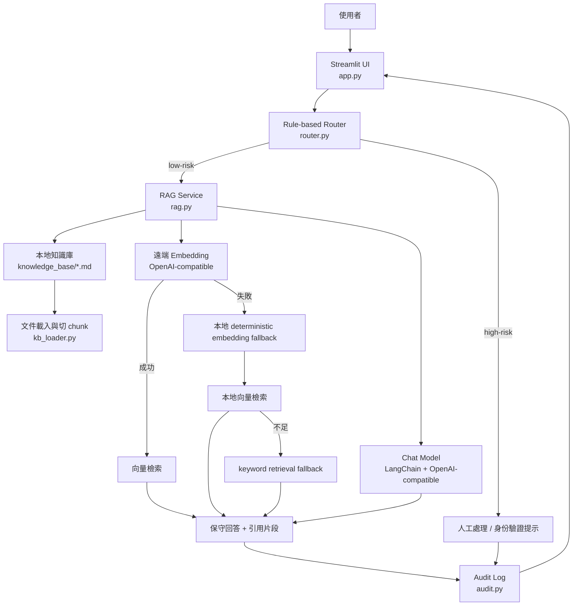
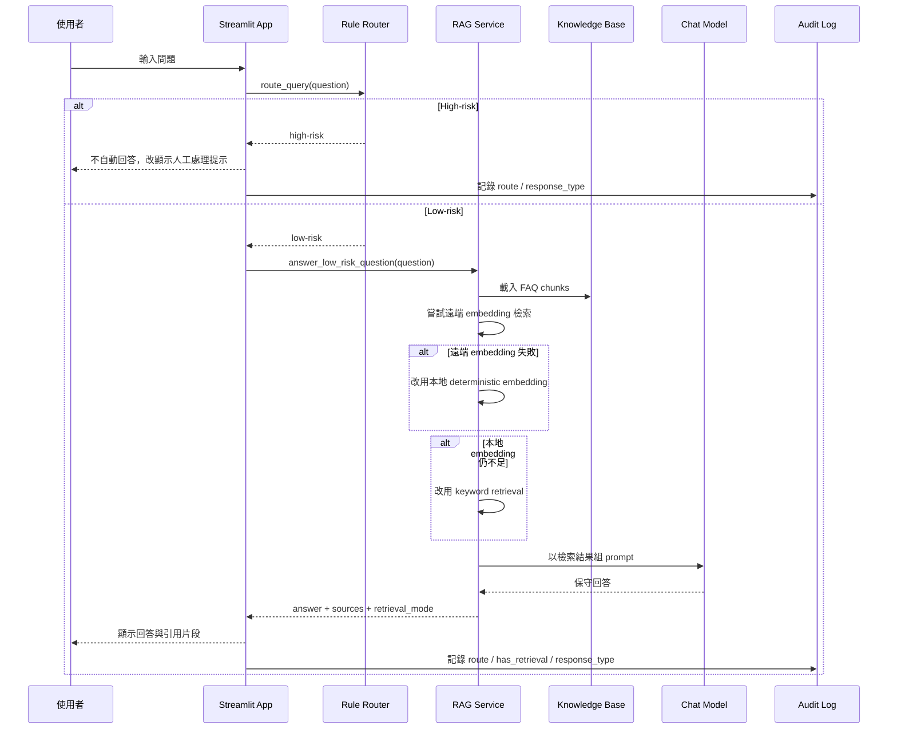

# 銀行 AI 客服 PoC Demo

這是一個面試展示用的最小可執行 Python 專案，主題是「銀行 AI 客服 PoC：RAG + 風險分流 + 簡單 audit log」。它刻意做得小而完整，重點是能跑、能 demo、能誠實解釋，而不是假裝成 production 銀行系統。

## 為什麼這個 demo 適合面試展示

- 可以在短時間內展示 AI 應用最常見的三個設計重點：RAG、風險分流、可追蹤性。
- 既有 UI，也有清楚的模組切分，方便講架構與取捨。
- 沒有依賴真實銀行內部 API，降低展示失敗風險。
- 沒有 API key 時也可跑 mock mode，面試前準備成本較低。

## 核心功能

- Streamlit 最小 Web UI
- Rule-based 風險分流
- LangChain 最小 RAG 流程
- 顯示來源文件與引用片段
- 找不到答案時保守拒答
- 簡單 audit log 顯示每次互動結果

## 架構圖



## 使用者發問後，背後實際發生什麼事



## 系統流程

1. 使用者在畫面輸入問題。
2. `router.py` 先用 rule-based 規則判斷 low-risk 或 high-risk。
3. 若為 high-risk，系統不自動回答，直接顯示需人工處理或身份驗證。
4. 若為 low-risk，`rag.py` 會載入本地 FAQ 文件做檢索。
5. 若有 `LLM_API_KEY` 與 `LLM_BASE_URL`，使用 LangChain 串 OpenAI-compatible endpoint 產生回答。
6. 若沒有設定或遠端 embedding 失敗，系統會自動退回本地 deterministic embedding，再不行才退到 keyword retrieval。
7. 每次互動都寫入簡單 audit log。

## 模組職責

- `app.py`: Streamlit UI、session state、訊息顯示、audit log 顯示
- `router.py`: 風險分流規則，決定 `low-risk` 或 `high-risk`
- `rag.py`: 最小 RAG 主流程、檢索 fallback、回答生成
- `kb_loader.py`: 讀取 markdown FAQ 並切成 chunks
- `llm_client.py`: 建立 LangChain chat model / embeddings client
- `audit.py`: 定義與累積 audit log entry
- `config.py`: 讀取環境變數與 mode 判斷

## 專案結構

```text
langchain-rag-demo/
├── app.py
├── audit.py
├── config.py
├── kb_loader.py
├── llm_client.py
├── rag.py
├── router.py
├── knowledge_base/
├── tests/
├── README.md
└── DEMO_TALK_TRACK.md
```

## 如何執行

### 1. 安裝相依

```bash
uv sync
```

### 2. 啟動 demo

```bash
uv run streamlit run app.py
```

預設會在本機開啟 Streamlit 介面。

## 部署到 Zeabur

這個專案現在已經補上 [zbpack.json](/Users/shawnpan/repos/langchain-rag-demo/zbpack.json)，會明確告訴 Zeabur：

- 使用 Python `3.12`
- 使用 `uv` 當套件管理器
- 以 Streamlit 模式啟動 [app.py](/Users/shawnpan/repos/langchain-rag-demo/app.py)

### 建議部署方式

1. 先把專案推到 GitHub。
2. 在 Zeabur 建立新服務並連接該 GitHub repo。
3. 這個 demo 現在已經在 repo root，通常不需要另外設定 `Root Directory`。
4. 在 Zeabur 的 Environment Variables 設定：
   - `LLM_API_KEY`
   - `LLM_BASE_URL`
   - `LLM_CHAT_MODEL`
   - `LLM_EMBEDDING_MODEL`
5. 若暫時不填 API 設定，服務仍可用 mock mode 啟動。
6. 點選 Redeploy 或讓 Zeabur 自動部署。

### Zeabur 上的執行模式

- 有設定 `LLM_API_KEY` 與 `LLM_BASE_URL`：live mode
- 沒有完整設定：mock mode

### 部署時要注意

- 這個專案目前沒有真正資料庫，所以不需要另外建立 Postgres 才能 demo。
- 若未來搬到 production，再考慮把知識庫與 audit log 換成 Postgres / pgvector / vector database。
- 只有在你未來再次把這個 demo 收回 monorepo 子目錄時，才需要額外設定 `Root Directory`。
- Zeabur AI Hub 的 `chat` 路徑已可正常運作；`embedding` 支援則可能因 provider / model 組合而異，所以 PoC 內建 fallback。

## 使用 `uv` 的安裝方式

本專案使用 `uv` 管理 Python 專案與依賴，啟動流程以 `uv sync` 與 `uv run ...` 為主，方便在面試前快速重建環境。

## 兩種模式

### Mode A: Mock mode

當下列環境變數未完整設定時：

- `LLM_API_KEY`
- `LLM_BASE_URL`

系統會自動進入 mock mode：

- 不呼叫外部模型
- 不做真實 embedding API 呼叫
- 使用本地 FAQ + deterministic embedding retrieval
- 以模板化方式整理回答

這讓 demo 即使在沒有 API key 的情況下也可以完整展示。

### Mode B: Live mode

當下列設定存在時，系統會用 LangChain 串接 OpenAI-compatible provider：

- `LLM_API_KEY`
- `LLM_BASE_URL`
- `LLM_CHAT_MODEL`
- `LLM_EMBEDDING_MODEL`

範例：

```bash
export LLM_API_KEY="your-zeabur-key"
export LLM_BASE_URL="https://your-openai-compatible-endpoint/v1"
export LLM_CHAT_MODEL="gpt-4o-mini"
export LLM_EMBEDDING_MODEL="text-embedding-3-small"
uv run streamlit run app.py
```

README 中這組設定可直接用於 Zeabur AI Hub；若你改用其他 OpenAI-compatible provider，也可沿用同一套方式。

### Live mode 的真實行為

- `chat`：優先使用遠端 OpenAI-compatible chat model
- `embedding`：先嘗試遠端 OpenAI-compatible embedding
- 若遠端 embedding 失敗：退回本地 deterministic embedding
- 若本地 embedding 仍找不到足夠相關內容：再退到 keyword retrieval

這代表就算 provider 端的 embedding 支援不穩定，整個 demo 仍然能持續運作並展示完整流程。

## 環境變數說明

- `LLM_API_KEY`: Zeabur AI Hub API key
- `LLM_BASE_URL`: Zeabur AI Hub 的 OpenAI-compatible base URL
- `LLM_CHAT_MODEL`: 對話模型名稱
- `LLM_EMBEDDING_MODEL`: embedding 模型名稱

## 哪些是 mock / simulated

- FAQ 文件內容是 mock 銀行文件
- 沒有任何真實銀行內部 API
- 沒有真實身份驗證
- high-risk 問題顯示「人工處理」只是分流結果，不代表真的有工單系統
- mock mode 的回答是基於本地文件整理，不代表真實模型推理
- 本地 deterministic embedding fallback 是 PoC 的 resiliency 設計，不代表 production 的最終 embedding 架構

## 哪些是 PoC，不是 production

- 規則路由是簡化版，沒有完整政策引擎
- audit log 只存在記憶體中，不做長期保存
- 使用本地 markdown 文件作為知識庫
- 沒有權限控管、登入、風控審批、監控告警、資料治理
- 不保證回答正確性，只強調保守與可解釋

## 為什麼這次選擇 LangChain，而不是 LangGraph

這次刻意選擇 LangChain，因為需求重點是做一個明天可展示的小型 PoC，而不是建立多代理、多節點狀態機。這個 demo 的流程其實很單純：

- 先做 rule-based risk routing
- low-risk 才進最小 RAG
- high-risk 直接轉人工

這種線性流程用 LangChain 已足夠，程式更短、更容易講解，也更適合面試時間有限的情境。

## 如果未來升級成更複雜 workflow，哪些部分可改用 LangGraph

若未來要升級，可將以下部分改成 LangGraph：

- 更複雜的多步驟風險審核流程
- 人工審核節點與狀態追蹤
- 多知識源檢索策略切換
- 申訴案件、異常交易、身份驗證等有條件分支
- 長對話狀態管理與多輪工具調用

## 為什麼這次不使用真正資料庫，而改用本地知識文件 + in-memory retrieval

這次目標是降低 demo 風險並提高可攜性，所以沒有接 Postgres、pgvector 或其他向量資料庫。對面試展示來說，本地 markdown 文件與 in-memory retrieval 有幾個好處：

- 不需要額外基礎設施
- 啟動成本低
- 容易重現
- 很適合講 PoC 與 production 的差別

如果未來進入正式化階段，可把知識庫與 audit log 分別替換為：

- `pgvector + Postgres`
- 專用向量資料庫
- 正式的觀測與稽核資料管線

## 面試時可以怎麼講這個 demo

### 1 分鐘講解稿

「這個 demo 是一個銀行 AI 客服的概念驗證，重點不是做完整銀行系統，而是展示我如何把 AI 功能拆成可控制的最小流程。前面先用 rule-based router 做風險分流，像轉帳、個資、申訴、額度調整這類高風險問題，一律不自動回答，直接要求人工處理。只有低風險 FAQ 才進入 LangChain 的最小 RAG 流程，從本地知識文件檢索相關內容，再產生保守回答並附來源片段。另外我保留一個簡單 audit log，讓每次互動都能看到路由結果、是否有檢索、以及回覆類型。這樣的設計很適合 PoC，因為可執行、可解釋，而且沒有 API key 時也能用 mock mode 順利展示。」 

## 建議 demo 流程

1. 先展示首頁上的 PoC / 非正式產品標示。
2. 問一題低風險問題，例如「信用卡帳單怎麼查？」。
3. 指給面試官看回答下方的來源片段與 audit log。
4. 再問一題高風險問題，例如「幫我把 10 萬轉到別的帳戶」。
5. 說明為什麼系統選擇不回答，而是轉人工。

## 備註

- 若遠端 embedding API 初始化或查詢失敗，系統會先回退到本地 deterministic embedding。
- 若連本地 embedding 都不足以找出相關段落，才會再退到 keyword retrieval。
- 這些 fallback 是刻意保留的，避免 demo 因為外部服務波動而整體失效。
- 側邊欄會顯示目前實際使用的檢索策略與 provider 錯誤詳情，方便 demo 時解釋系統正在怎麼運作。
